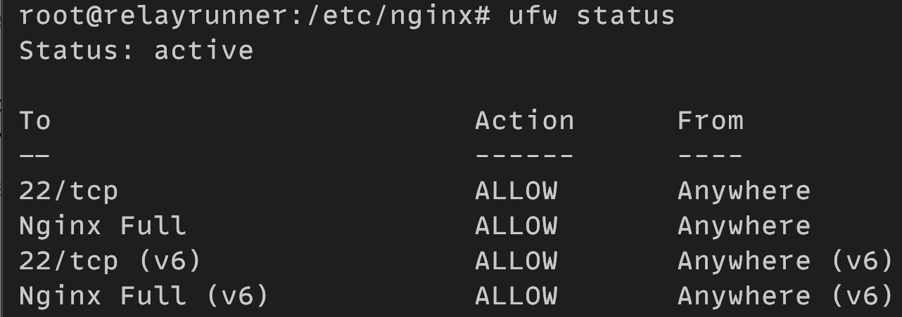

# Firewall

By setting up a firewall we’ll be able to monitor, allow, and block incoming and outgoing network traffic based on security rules that we define. Multiple network ports may be open and listening for incoming connections by default which leaves the relay open to various network based attacks. By monitoring and gaining control over which ports are open and closed we’ll be able to mitigate many of the network based attacks.

We’ll be using the [Uncomplicated Firewall (UFW)](https://launchpad.net/ufw "Uncomplicated Firewall (UFW)") which is a firewall configuration tool that allows us to easily manage a [netfilter](https://www.netfilter.org/ "netfilter") firewall by using the provided `ufw` command.

## Install UFW

To install UFW run:

```bash
apt install ufw
```

## Check Status

To check the status of UFW run:

```bash
ufw status
```

The output indicates if the firewall is `active` or `inactive`.

## Default Policy

Before enabling UFW and activating the firewall, we’re going to first discuss the default policies for incoming and outgoing network traffic. The default policies determine how traffic that doesn’t match a specific rule is controlled.

By default, UFW is configured to deny all incoming connections and to allow all outgoing connections. This means no one can establish a connection with the server while an application running on the server can establish a connection outside of the server.

The following commands can be run to reset the default behavior of UFW for incoming and outgoing connections.

### Deny Incoming

To deny all incoming connections run:

```bash
ufw default deny incoming
```

### Allow Outgoing

To allow all outgoing connections run:

```bash
ufw default allow outgoing
```

## Allow Incoming SSH Connections

When UFW is enabled by default it will block all incoming connections to the relay. With the current configuration of UFW we’ll be disconnected once we enable it since we’re using SSH to access the relay. Therefore, we need to first allow incoming SSH connections before we enable UFW.

To allow incoming SSH connections we need to open the port the relay is using for SSH.

If you’re using the default port for the SSH server, i.e., port `22`, you can run the following command to allow incoming SSH connections:

```bash
ufw allow ssh
```

If you changed the default port for the SSH server, run the following command to allow incoming SSH connections on the custom port:

```bash
ufw allow <port-number>/tcp
```

Here `<port-number>` should be replaced with the custom listening port number you set for the SSH server.

## Allow Incoming Nginx Connections

We're going to set up an Nginx reverse proxy in the next section, so we're going to allow incoming HTTP and HTTPS connections on ports `80` and `443`, respectively.

To allow incoming HTTP and HTTPS connections you can run:

```bash
ufw allow 'Nginx Full'
```

## Logging

By default, UFW will keep logs using low mode which means it logs all the packets that are blocked or allowed by the rules we set.

### Disable Logging

If you don’t have a valid reason to keep UFW’s logging active, you should disable the logging because it can take up GBs of the relay's storage.

```bash
ufw logging off
```

## Enable UFW

After setting the incoming connections rules and setting the logging preference, we’re now ready to enable UFW which will activate it and apply the rules we set.

To enable UFW run:

```bash
ufw enable
```

After running the above command, you may receive a warning message that looks similar to:

```bash
Command may disrupt existing ssh connections. Proceed with operation (y|n)?
```

If you successfully configured the rules for the incoming SSH connections, enter `y` and press enter.

After enabling UFW, you can check the status by running:

```bash
ufw status
```

The output indicates if the firewall is `active` or `inactive` as well as all of the rules you set for your firewall.

The status of your firewall should look similar to the following:



## Enable on Boot

UFW should already be enabled to start automatically on boot, but if it isn’t run:

```bash
systemctl enable ufw
```
