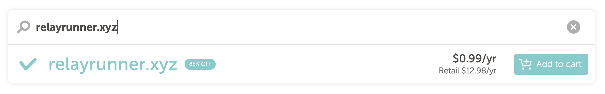
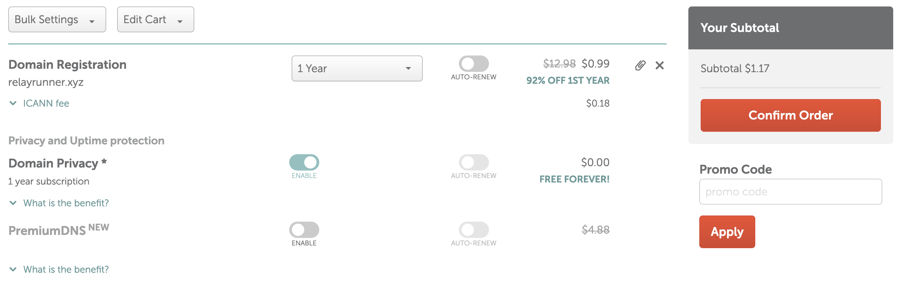
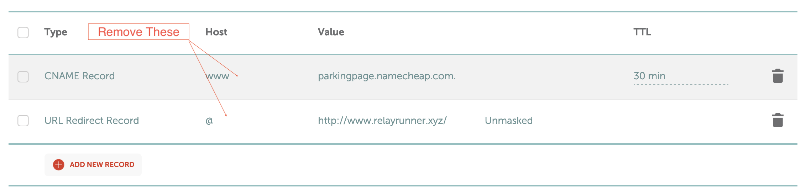
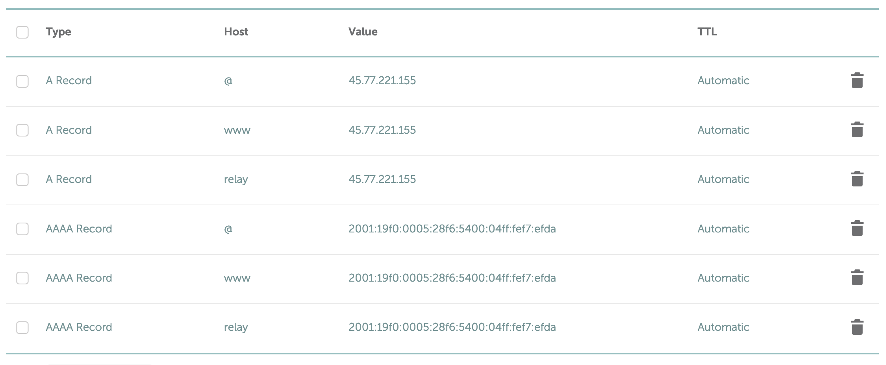

# Get a Domain Name

For this guide we'll be using [Namecheap](https://www.namecheap.com "Namecheap"). You can use any domain registrar you like, but the images in this guide will be specific to Namecheap.

## Register

First, go to Namecheap and search for a domain name. Once you find one you like, add it to your cart and proceed to checkout. You can get a `.xyz` for about $1 for the first year, so if you don't want to commit to a domain just yet get one of these to get started.

## Checkout

Once you're at the checkout screen, you'll see a few options. You can toggle on the switch for `Domain Privacy` which is free and leave the rest toggled off. If you like your domain and plan to keep it, it's recommended to turn on `AUTO-RENEW` as well.

## DNS

After your order is processed, you can go to your Domain List and see your new domain. You can click on the `Manage` button, and then choose `Advanced DNS` to get started hooking up your domain to the server you created in the last section. We'll be adding a few records so make sure you have the IP addresses from the server from the last section.

First, remove the default records that Namecheap added for you. You should have a `CNAME` record for `www` and an `A` record for `@`.

Now we'll add a few records for `@` which is the root domain (relayrunner.xyz), `www` (www.relayrunner.xyz), and `relay` (relay.relayrunner.xyz). You will need to create an `A` record for each IPv4 address and a `AAAA` record for each Ipv6 address. When you're done it should look like the image below:

## DNS Propagation

It can take up to 24 hours for your DNS changes to propagate. You can check the status of your DNS changes by going to [whatsmydns.net](https://www.whatsmydns.net "whatsmydns.net")

When you enter your domain name you should see the IP addresses you added in the previous step. If you don't see them yet, wait a few hours and check again.

## Domain Name Registrars

- [Hostinger](https://www.hostinger.com "Hostinger") \* Pay with Bitcoin

- [Porkbun](https://porkbun.com "Porkbun") \* Pay with Bitcoin
