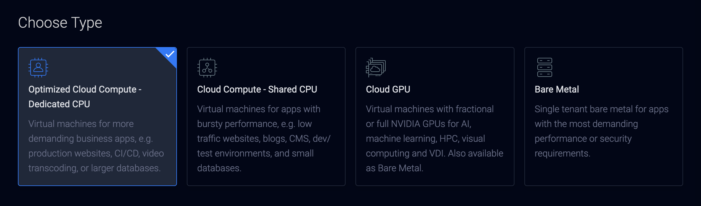
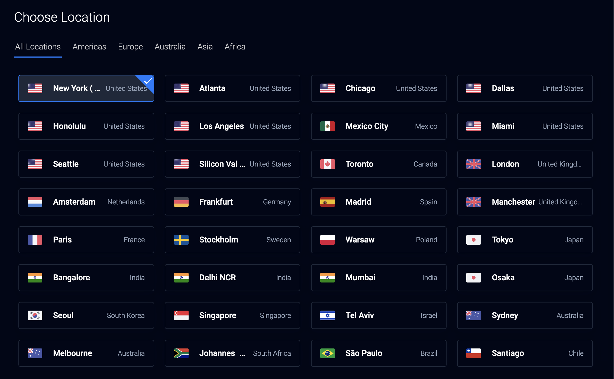
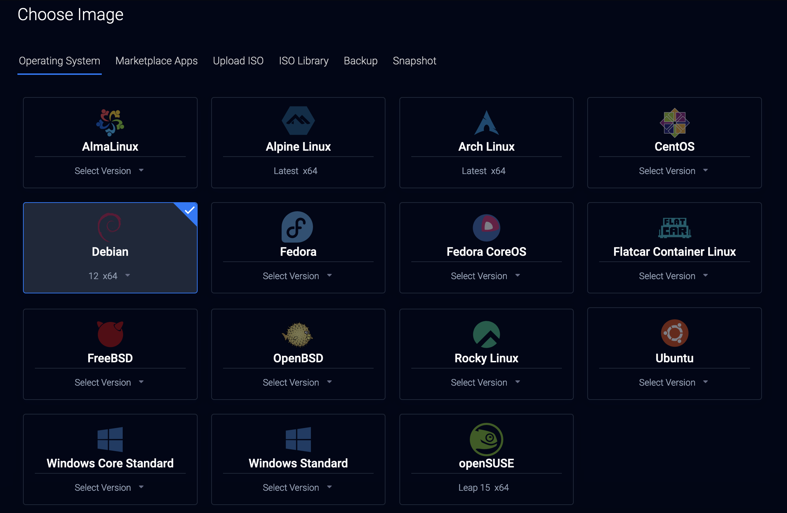
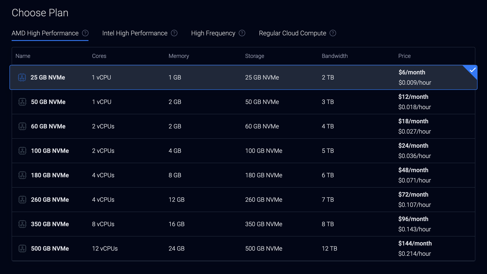
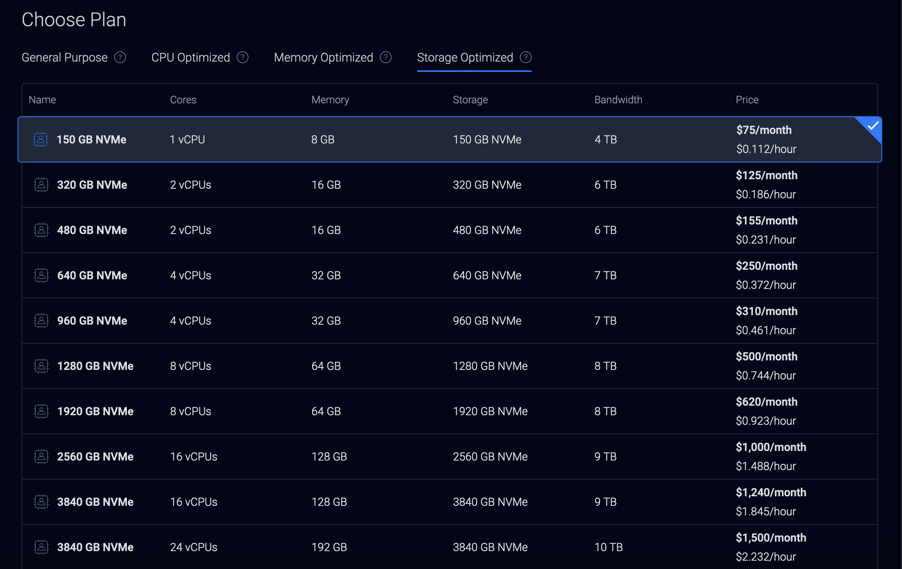
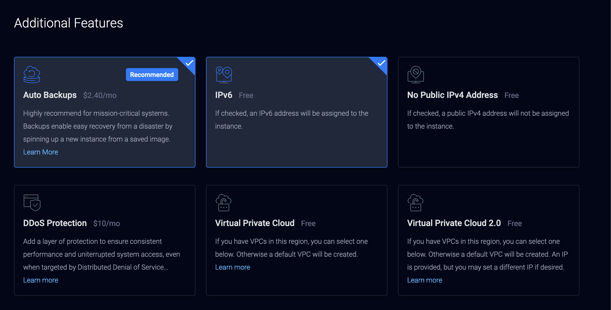
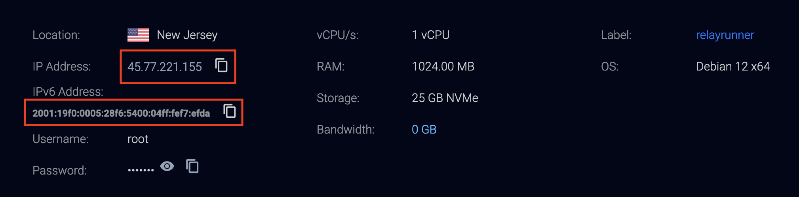

# Get a Server

For this guide we'll be using a Virtual Private Server (VPS) from [vultr](https://www.vultr.com/?ref=9247696). You can use any VPS provider you like, but I recommend vultr because they have a wide range of locations and their pricing is pretty good.

## Create an Account

First, you'll need to create an account on vultr. You can do that [here](https://www.vultr.com/?ref=9247696).

## Deploy a Server

Once you've created an account, you can deploy a server by clicking on the `Deploy` button.

## Choose a Server Type

If you're just starting out or just plan to use this as a personal relay, I recommend using the `Cloud Compute - Shared CPU` server type. It will only cost you about $6 per month and will be more than enough to store your own notes and test things out.

If you plan to run a public relay, you may want to choose a more powerful server type. I recommend their `Optimized Cloud Compute - Dedicated CPU` option.

## Choose a Server Location

You can choose a server location that is closest to you or your target audience. I'll be choosing `New York (NJ)` since it's closest to my location and I only plan to use this as a personal relay.

## Choose an Operating System

You can choose any operating system you like, but I for this guide I'll be using `Debian 12 x64`.

## Choose a Plan

If you chose the `Cloud Compute - Shared CPU` server type, you can choose the $6 per month plan since it will likely be more than enough for your needs and you can always upgrade later.

If you chose the `Optimized Cloud Compute - Dedicated CPU` server type, I recommend choosing one of the `Storage Optimized` plans since you'll likely need more storage for a public relay.

## Additional Features

You can add additional features like backups, DDoS protection, and more if you like. I recommend adding backups for peace of mind and you might as well enable IPv6 since it's free and could maybe one day matter. If you're running a public server you might also consider enabling DDoS Protection.

## Server Settings

You have the option to choose an ssh key that will automatically be added to your server. If you don't have one don't worry we'll be settings one up later.

## Server Hostname & Label

You can choose a hostname and label for your server. I recommend choosing something that will help you remember what this server is for.

## Server Info

After your server is provisioned take note of the IP and IPv6 address since we'll need those in the next section.

## Some Other places to get a server

- [OrangeWebsite](https://orangewebsite.com/) * Pay with Bitcoin
- [Njalla](https://njal.la/) * Pay with Bitcoin
- [1984 Hosting](https://1984.hosting/) * Pay with Bitcoin
- [Hetzner](https://www.hetzner.com/)
- [AWS](https://aws.amazon.com/)
- [Linode](https://www.linode.com/)
- [Digital Ocean](https://www.digitalocean.com/)
