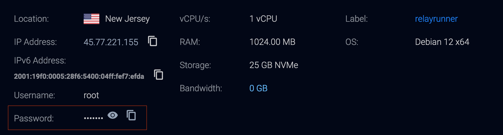
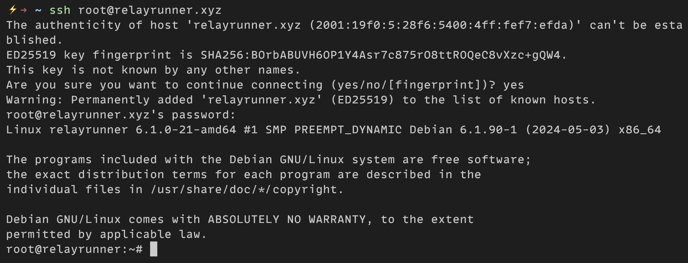
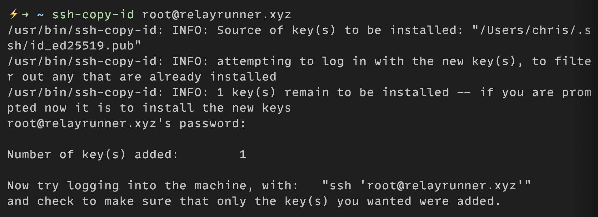

# Remote Access

You'll need to access your server remotely to install software, update the server, and manage the relay. This guide will show you how to access your server using SSH.

## Login to your Server

You'll need to login to your server using SSH.

You can do this by running:

```bash
ssh root@relayrunner.xyz
```

Be sure to replace `relayrunner.xyz` with the domain name you're using with your relay.

### Confirm Fingerprint

When you first attempt to SSH into the relay from your client you’ll be prompted with the SSH server fingerprint and asked to confirm the connection.

To confirm the connection answer the prompt by typing `yes` and pressing enter.

After answering `yes` and establishing the connection the SSH server fingerprint will be stored in the client’s `known_hosts` file which is located in the `.ssh` hidden directory.

### Enter Password

You'll then be prompted to enter the password for the user you're using with SSH, i.e., `root` in our case.

You can find the password in your server details.



### SSH Login Output

If the SSH login was successful, the output should look similar to the following:



After successfully logging into your server, it's recommended to set up public key authentication and to disable password authentication or at the very least to change the password provided by your VPS to be something unique and secure.

## Exit SSH Server

To exit the SSH server session run:

```bash
exit
```

You should now be returned to the terminal of your client.

## Public Key Authentication

Since the relay is visible from the internet and not just present on a Local Area Network (LAN), it needs to be secured against various attacks, e.g., brute forcing your SSH login password.

To improve the security of the SSH login, we’re going to set up public key authentication and disable password authentication. This improves the security of the SSH login by reducing the possibility of unauthorized access since an SSH key pair will be used to login to the server. Therefore, only someone with physical possession of the private key can easily login to the server.

Since anyone with the private key will be able to login to the server, it’s important to properly secure the private key by using secure key management practices and to use a passphrase which is used to encrypt the private key.

### Copy Public Key

You can copy your SSH public key to your relay by running the following command from your client:

```bash
ssh-copy-id -i <path-to-public-key-file> root@relayrunner.xyz
```

Be sure to replace `<path-to-public-key-file>` with the path to the SSH public key you're using with your relay which is located in the `/root/.ssh` directory if you used the default location when generating your SSH key pair.

Also, be sure to replace `relayrunner.xyz` with the domain name you're using with your relay.

After running the `ssh-copy-id` command you’ll initially be prompted to enter the SSH login password.

Once you successfully authenticate the user you’ll see output similar to:



The public key will be appended to the `authorized_keys`
file on the relay which will be created if it doesn’t exist, and the connection will be closed.

The `authorized_keys` file contains all of the public keys that have been copied to the relay and is located in the `/root/.ssh` directory.

If you ever want to remove a public key, then open the `authorized_keys` file, delete the line containing the public key you want to remove, and save the file.

### Login

Now you can login to your relay and you shouldn't be prompted to enter a password since you're using public key authentication:

```bash
ssh root@relayrunner.xyz
```

## Disable Password Authentication

To add another layer of security to the relay, we’re going to disable the password authentication for SSH which means only public key authentication will be used to login to the relay. Preventing password authentication protects the relay from various attacks like attempting to brute force or guess the SSH login password.

Before disabling password authentication, make sure you’re able to login with public key authentication and the user you’re logging in with has `sudo` privileges which should be the case if you’ve been following along.

To start SSH into the relay using public key authentication if you’re not already logged in.

Next, we need to open the `sshd_config` file on the relay by running:

```bash
nano /etc/ssh/sshd_config
```

To disable tunneled clear text passwords locate the `PasswordAuthentication` keyword, uncomment it, and set it to `no`.

The line should look like the following:

```bash
PasswordAuthentication no
```

To disable challenge-response passwords locate the `KbdInteractiveAuthentication` keyword and set it to `no`.

The line should look like the following:

```bash
KbdInteractiveAuthentication no
```

To disable PAM authentication, account processing, and session processing locate the `UsePAM` keyword and set it to `no`.

The line should look like the following:

```bash
UsePAM no
```

After editing the file, save and exit.

For the changes to take effect we need to reload the SSH server which we can do by running:

```bash
systemctl reload sshd
```

Now, if you attempt to SSH into the relay from a client that doesn’t have access to the private key from your SSH key pair, then the login attempt will be refused without giving the option of entering the SSH login password.

If you lose access to your SSH keys, then you'll be unable to access the relay remotely using SSH. Be sure to securely backup the passphrase for the private key if you used one as well as the SSH keys using, e.g., a USB.
